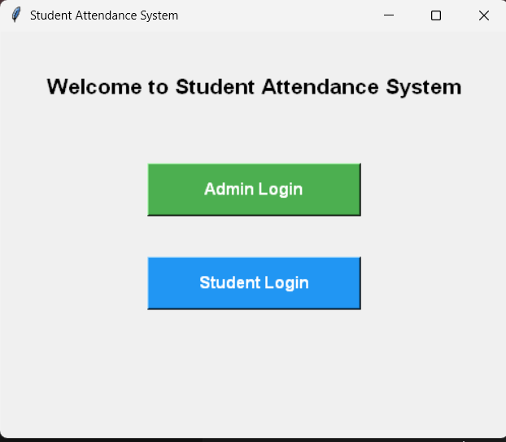
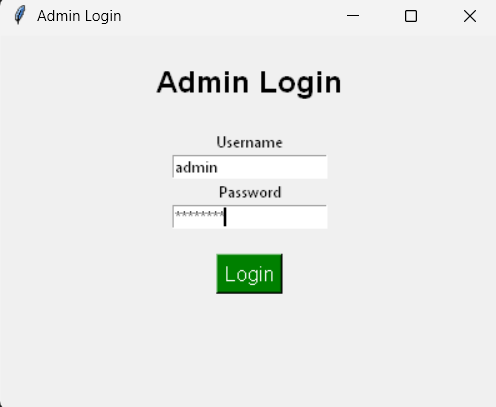
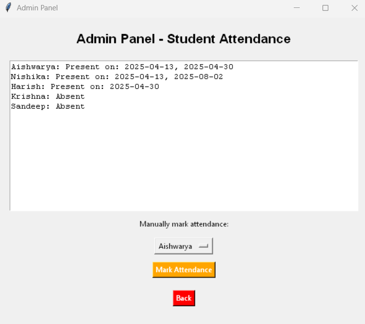
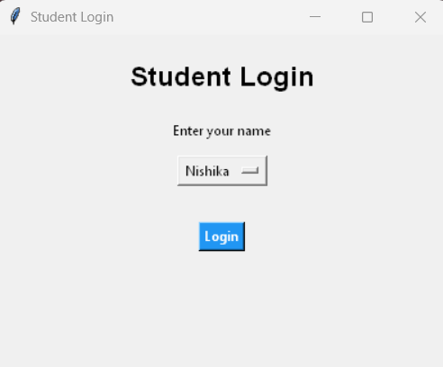

# Student Fingerprint Attendance System

This project is a **Python GUI application** built using **Tkinter** to simulate a fingerprint-based student attendance system. It features:

- ✅ Separate login for Admin and Students
- ✅ Simulated fingerprint attendance for specific students
- ✅ Real-time attendance status
- ✅ Admin panel to view attendance records

---

## 👨‍💻 Team Members

- Aishwarya  
- Nishika  
- Harish

_(Note: Sandeep and Krishna are not part of the team – they are marked absent by default)_

---

## 💡 How It Works

1. **Admin Login** – View all attendance records
2. **Student Login** – Choose your name to mark attendance
3. Attendance updates reflect instantly in the admin panel

---

## 🛠️ Tech Stack

- Python 3
- Tkinter (GUI)
- CSV (for storing attendance data)

---

## 📂 Project Structure
StudentFingerprintAttendance/
├── attendance_system.py    # Main GUI app
├── attendance.csv          # Stores attendance logs
├── README.md               # Project documentation
└── 1.png          # App screenshot

---

## 📸 Screenshot

| Home Page | Admin Login | Attendance Record | Student Panel |
|-----------|-------------|-------------------|----------------|
|  |  |  |  |

---

## 📌 Note

This project was developed as a part of academic coursework. For learning purposes only.

---

## 📬 Contact

For queries or collaborations:  
📧 nishikaceline05@gmail.com  
🔗 [LinkedIn – Nishika Celine CS](https://www.linkedin.com/in/nishika-celine-c-s-762269279)  
📁 [GitHub Repository](https://github.com/NishikacelineCS/StudentFingerprintAttendance)

